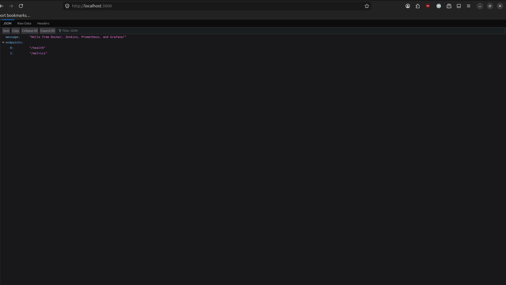

# Local DevOps Monitoring Demo

This project demonstrates this flow locally:

```text
Code push -> Jenkins builds Docker image -> deploys container locally -> Prometheus scrapes metrics -> Grafana visualizes
```

## Application



The Node.js application running on port 3000 with endpoints for health checks, work simulation, and metrics exposure for Prometheus monitoring.

## Running Containers


All four services running together - Node.js application, Prometheus, Grafana, and Jenkins containers with their respective ports exposed and interconnected through Docker Compose network.

## Project Structure

```text
my-project/
├── app/
│   └── server.js
├── grafana/
│   ├── dashboards/
│   └── provisioning/
├── jenkins/
│   └── Dockerfile
├── Dockerfile
├── Jenkinsfile
├── docker-compose.yml
├── package.json
└── prometheus.yml
```

## Run Without Jenkins

Build and start the app, Prometheus, and Grafana:

```bash
docker compose up -d --build app prometheus grafana
```

Open:

- App: http://localhost:3000
- Metrics: http://localhost:3000/metrics
- Prometheus: http://localhost:9090
- Grafana: http://localhost:3001

Grafana login:

```text
username: admin
password: admin
```

The dashboard is provisioned automatically under `Local Demo / Node App Monitoring`.

## Prometheus


Prometheus time-series database interface for querying and analyzing scraped metrics, showing target health and metric exploration capabilities.

## Grafana


Real-time monitoring dashboard displaying HTTP request metrics, response times, request counters, and system health indicators automatically provisioned for the Node.js application.

Generate sample traffic so the dashboard has data:

```bash
for i in {1..20}; do curl http://localhost:3000/work; done
```

On Windows PowerShell:

```powershell
1..20 | ForEach-Object { Invoke-WebRequest http://localhost:3000/work | Out-Null }
```

## Run Jenkins Locally

Start Jenkins too:

```bash
docker compose up -d --build
```

Open Jenkins:

```text
http://localhost:8080
```

Get the initial admin password:

```bash
docker exec demo-jenkins cat /var/jenkins_home/secrets/initialAdminPassword
```

Install suggested plugins, then create a Pipeline job pointing to this repository and use the included `Jenkinsfile`.

For the Jenkins pipeline to build and deploy Docker containers, this demo builds a local Jenkins image with the Docker CLI and Compose plugin. The Jenkins container also mounts the host Docker socket:

```yaml
- /var/run/docker.sock:/var/run/docker.sock
```

This is convenient for a local assignment demo, but it is not a production security pattern.

## Useful Checks

Check running containers:

```bash
docker compose ps
```

Check Prometheus target status:

```text
http://localhost:9090/targets
```

Stop everything:

```bash
docker compose down
```
